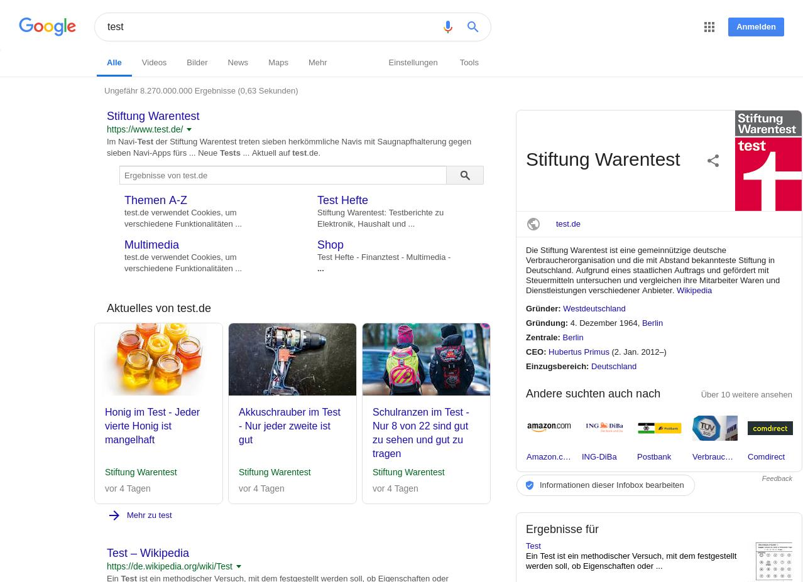
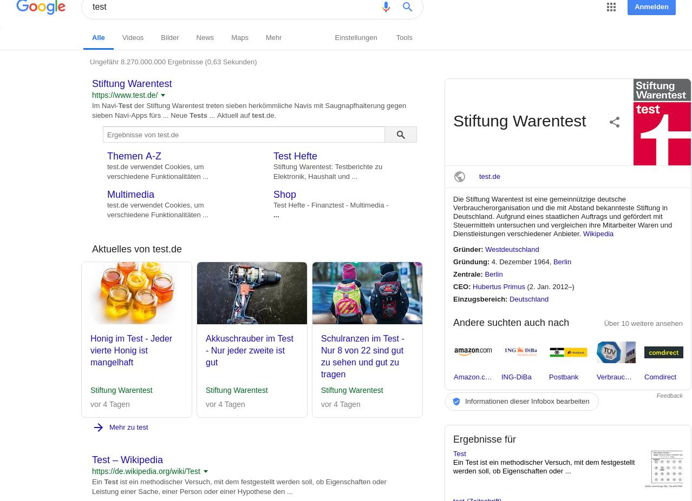
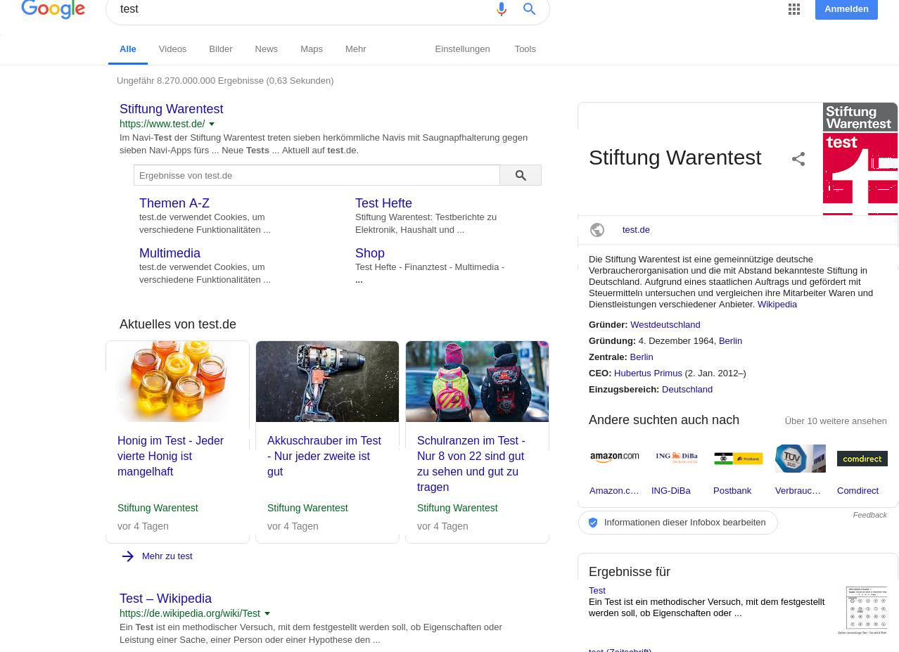

# Cloud Browser <a href="https://ci.langl.eu/job/CloudBrowser/" target="_blank"></a>

Cloud Browser which takes over the processing of webpages for older devices.

Made for the project AWT at TU-Berlin and Fraunhofer FOKUS.

## Getting Started
Documentation can be found [here](https://langleu.github.io/CloudBrowser/).

### Prerequisites

```
Node.js >= v8
```

### Installing

```
git clone https://github.com/Langleu/CloudBrowser
```

```
cd CloudBrowser
```

```
npm install
```

### Start

```
npm run dev
```
or
````
docker-compuse up
````

### Limitations

Current Limitations:

Running it on MacOS as server is currently limited to 6 fps same for Windows.
Linux has reached 25 fps in current tests.

Stick to screenshots as requested from our supervisor.

## ToDos

- [x] use SSR with React/Vue or Templating Engine
- [x] clean up code
- [x] use css framework
- [x] switch to winston
- [x] pseudo accounts
    - [x] sessions
- [x] test out diffs of images

## Diffs of images
We used several implementations to get the diff image of 2 initial images.
The Goal was to just send the diff of 2 images to save space.

We used [Resemble.js](https://github.com/rsmbl/Resemble.js) as it provided a good and simple module to get the pure difference of two images and not just an overlay.

Both initial supplied images were ~135kb and the output image was almost 6 times bigger (762kb).
This and the fact that it took 100-200ms to process the diff made it unusable for our project.

As we generate up to 30 images per second it would take an additional 3-6 seconds to calculate the difference of all images.

### input images



### outcome

